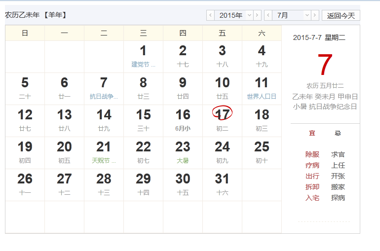

## 简介
 本套日历现依赖于jQuery实现，根据香港天文台提供的数据，关于中国农历的测算从1901-2100年的测算数据，不一定准确，仅供参考。

## 文件描述
  JS文件中（almanac.js）均有详细的注释。里面主要包含三个对象
  * `Almanac` 这部分代码包含日历的绘画、更新、二十四节气、天干地支等信息的计算和显示
  * `DateSelection` 日历顶部右侧切换年、月所封装的操作函数
  * `global` 全局变量

  CSS文件中（almanac.css）包含了日历所需的CSS样式文件
  images文件夹中包含所需的图片文件

## 功能列表
  * 每日阴历大图显示（天干、地支、二十四节气等），见日历右侧
  * 单击/双击日历单元格事件
  * 日历初始化之后回调函数
  * 支持的浏览器 IE8+,FireFox3.5+,Opera 10+,Chrome 3+ 

## 截图
  

## 使用方法
  1. 在页面中插入HTML
  ```
  <div class="zh-almanac" id="id_almanac" data-id="2">
    <div class="hint-bar clearfix">
      <span class="title-bar" id="GZ">
      </span>
      <div class="control-bar">
        <div class="control-module year-control">
          <a class="prev" id="nianjian" action="prev" href="javascript:;"></a>
          <div class="control"><i class="trigger"></i>
            <div val="2015" class="field year">2015年</div>
          </div>
          <a class="next" id="nianjia" action="next" href="javascript:;"></a>
          <ul class="list year-list hidden">
          </ul>
        </div>
        <div class="control-module month-control">
          <a class="prev" id="yuejian" action="prev" href="javascript:;"></a>
          <div class="control"><i class="trigger"></i>
            <div val="7" class="field month">7月</div>
          </div>
          <a class="next" id="yuejia"  action="next" href="javascript:;"></a>
          <ul class="list month-list hidden">
          </ul>
        </div>
        <div class="btn-today">返回今天</div>
      </div>
    </div>
    <div class="alc-container">
      <div class="left">
        <ul class="dates-hd clearfix">
          <li data-id="6" class="days-title last ">日</li>
          <li data-id="0" class="days-title ">一</li>
          <li data-id="1" class="days-title ">二</li>
          <li data-id="2" class="days-title ">三</li>
          <li data-id="3" class="days-title ">四</li>
          <li data-id="4" class="days-title ">五</li>
          <li data-id="5" class="days-title ">六</li>
        </ul>
        <ol class="dates-bd clearfix">
        </ol>

      </div>
      <div class="right">
        <div class="almanac-tips">
          <div class="dates-bar">
            <span class="date"></span><span class="weekday"></span>
          </div>
          <div class="date-show-panel"></div>
          <div class="desc">
            <div class="lunar"></div>
            <div class="lunar-ganzhi"></div>
              <div class="lunar-term"></div>
            </div>
          </div>
          <div class="almanac-extra clearfix">
            <div class="suited">
              <h3 class="st-label">宜</h3>
              <ul class="st-items clearfix" title="">
              </ul>
            </div>
            <div class="tapu">
              <h3 class="st-label">忌</h3>
              <ul class="st-items clearfix" title="">
              </ul>
            </div>
            <div class="ban hidden">
              <ul class="st-items clearfix" title="">
              </ul>
            </div>
          </div>
      </div>
    </div>
  </div>
   ```

  2. 在页面中引入CSS\JS相关文件

  ```
  <link href="./almanac/almanac.css" rel="stylesheet" type="text/css" />
  <script src="./jquery.1.10.2.min.js"></script> 
  <script src="./almanac/almanac.js"></script>
  ```

  3. 使用如下代码进行调用

  ```
  $("#id_almanac").almanac({
    /**
     * 画日历之后调用函数
     */
    afterDrawCld: function(year, month){
    console.log('加载完成');
    },
    /**
     * 双击某一天的事件
     */
    dbClickDay: function(elem){
    var _this = $(elem);
    console.log('阳历：' + _this.attr('data-year') + '年' + _this.attr('data-month') + '月' + _this.attr('data-solor'));
    },
    /**
     * 单击某一天的事件
     */
    clickDay: function(elem){
    var _this = $(elem);
    console.log('阳历：' + _this.attr('data-year') + '年' + _this.attr('data-month') + '月' + _this.attr('data-solor'));
    }
  });
  ```

  详细请参见index.html示例文件。

## Q/A
  联系方式：navcat@foxmail.com


## License
The MIT License (MIT)

Copyright (c) 2015 NavCat

Permission is hereby granted, free of charge, to any person obtaining a copy
of this software and associated documentation files (the "Software"), to deal
in the Software without restriction, including without limitation the rights
to use, copy, modify, merge, publish, distribute, sublicense, and/or sell
copies of the Software, and to permit persons to whom the Software is
furnished to do so, subject to the following conditions:

The above copyright notice and this permission notice shall be included in all
copies or substantial portions of the Software.

THE SOFTWARE IS PROVIDED "AS IS", WITHOUT WARRANTY OF ANY KIND, EXPRESS OR
IMPLIED, INCLUDING BUT NOT LIMITED TO THE WARRANTIES OF MERCHANTABILITY,
FITNESS FOR A PARTICULAR PURPOSE AND NONINFRINGEMENT. IN NO EVENT SHALL THE
AUTHORS OR COPYRIGHT HOLDERS BE LIABLE FOR ANY CLAIM, DAMAGES OR OTHER
LIABILITY, WHETHER IN AN ACTION OF CONTRACT, TORT OR OTHERWISE, ARISING FROM,
OUT OF OR IN CONNECTION WITH THE SOFTWARE OR THE USE OR OTHER DEALINGS IN THE
SOFTWARE.

